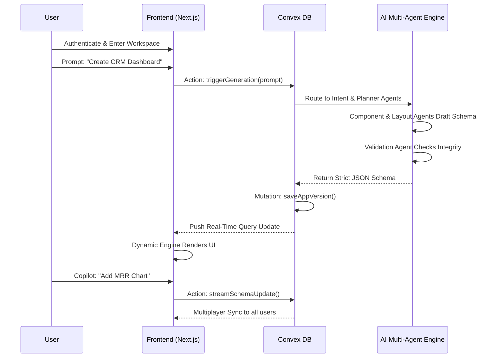
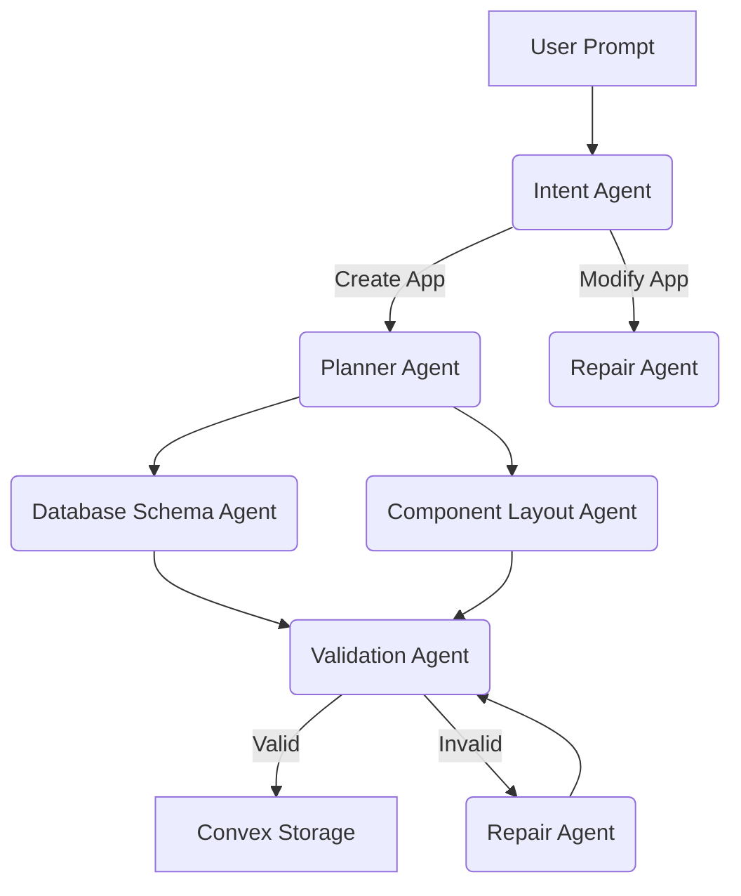
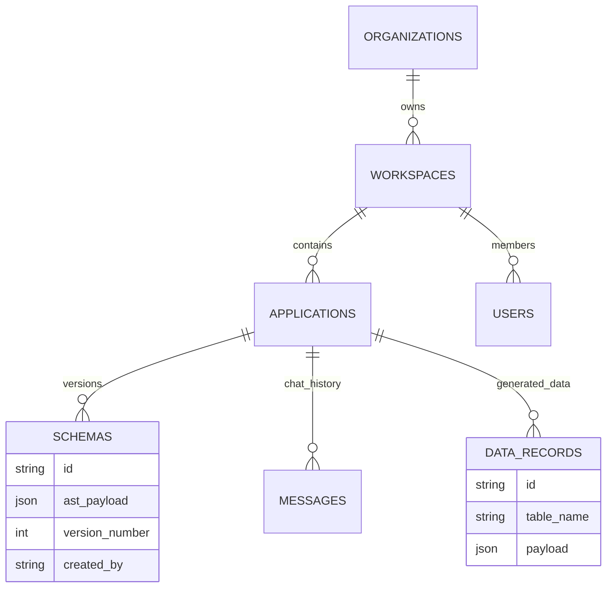

# MorphOS: Enterprise Product Requirements Document (PRD)

**Version:** 2.0.0
**Status:** Implementation Ready
**Author:** MorphOS Product & Engineering Team

---

## Table of Contents
1. [Executive Summary](#1-executive-summary)
2. [Vision & Mission](#2-vision--mission)
3. [Market & Competitors](#3-market--competitors)
4. [Product Philosophy & Design](#4-product-philosophy--design)
5. [Target Users & Personas](#5-target-users--personas)
6. [Complete End-to-End Product Flow](#6-complete-end-to-end-product-flow)
7. [Complete User Flows](#7-complete-user-flows)
8. [Goals, Scope & Milestones](#8-goals-scope--milestones)
9. [Component Library Specification](#9-component-library-specification)
10. [Dynamic UI Rendering Engine](#10-dynamic-ui-rendering-engine)
11. [Complete JSON Specification](#11-complete-json-specification)
12. [AI Agent Architecture](#12-ai-agent-architecture)
13. [Prompt Engineering System](#13-prompt-engineering-system)
14. [Workspace Architecture](#14-workspace-architecture)
15. [Database Design](#15-database-design)
16. [Convex Specification](#16-convex-specification)
17. [Version Control System](#17-version-control-system)
18. [Deployment Pipeline](#18-deployment-pipeline)
19. [Plugin Architecture](#19-plugin-architecture)
20. [Theme Engine](#20-theme-engine)
21. [State Management](#21-state-management)
22. [Security](#22-security)
23. [Error Recovery](#23-error-recovery)
24. [Performance Specifications](#24-performance-specifications)
25. [Frontend Folder Structure](#25-frontend-folder-structure)
26. [Implementation Roadmap](#26-implementation-roadmap)
27. [Engineering Decisions](#27-engineering-decisions)
28. [Developer Checklist](#28-developer-checklist)

---

## 1. Executive Summary
MorphOS is an AI-powered Generative Operating Interface replacing static SaaS applications. Instead of subscribing to fragmented tools, users describe their workflows in natural language, and MorphOS instantly synthesizes a fully functional, collaborative software application. Powered by Next.js, Convex, and Multi-Agent Large Language Models, it generates the frontend UI, backend schema, business logic, and real-time multiplayer synchronization on the fly. 

## 2. Vision & Mission
- **Vision:** To eradicate software friction by making the creation of custom, enterprise-grade software as simple as speaking.
- **Mission:** Build a zero-latency, AI-native operating system that empowers anyone to generate, evolve, and scale software dynamically through natural language and real-time collaboration.

## 3. Market & Competitors
The Custom Software Market is projected to reach $146B by 2030. Generative AI allows us to capture the "Long Tail" of internal tooling.

| Competitor | Paradigm | Core Weakness vs MorphOS |
|---|---|---|
| **ChatGPT** | Chat Interface | Outputs code, not a live hosted, multiplayer application. |
| **Bolt.new / Lovable** | AI Coding Assistant | Builds codebases for developers, not runtime apps for end-users. |
| **v0 by Vercel** | UI Generation | Generates static React, lacks database, backend logic, and real-time state. |
| **Retool / Bubble** | Low-Code / No-Code | Steep learning curve, rigid dragging, requires database knowledge. |
| **Notion AI** | Document AI | Limited to text and tables; cannot generate complex operational apps. |

## 4. Product Philosophy & Design
- **Software should mold to the user.** Interfaces are ephemeral. If a user needs a chart, it exists. If they no longer need it, it dissolves.
- **Zero Configuration:** The user never touches a database schema.
- **Deterministic Outputs:** Generated UI maps cleanly to strict JSON schemas.
- **Instantly Collaborative:** Every generated view is multiplayer by default.
- **Premium Aesthetics:** Glassmorphism, 60fps animations, Apple-level polish.

## 5. Target Users & Personas
- **Sarah (Operations Lead):** Needs an inventory tracker. Has zero coding experience. Values speed.
- **Alex (Startup Founder):** Needs a custom CRM. Values aesthetic, reliability, and Stripe integration.
- **David (Product Manager):** Prototyping functional applications instantly before assigning engineers.
- **Emma (Enterprise Team Lead):** Needs internal dashboards that comply with strict RBAC.

---

## 6. Complete End-to-End Product Flow



## 7. Complete User Flows

| User Profile | Goals | Pain Points | Expected Outcome |
|---|---|---|---|
| **Startup Founder** | Build MVP operations dashboard. | No budget for engineers. | A fully functional CRM + Finance dashboard in 10 seconds. |
| **Product Manager** | Prototype a feature workflow. | Wireframes aren't functional. | A clickable, database-backed prototype to test with users. |
| **Operations Manager** | Manage complex inventory data. | Excel is too manual. | An inventory table with AI insights and automated alerts. |
| **Enterprise Team** | Secure internal tooling. | IT backlog is 6 months. | Instant RBAC-compliant dashboards connected to their data. |

---

## 8. Goals, Scope & Milestones
- **TTFV (Time to First Value):** < 5 seconds from prompt to UI rendering.
- **Reliability:** 99% JSON schema adherence from AI.
- **MVP Scope:** Natural Language Input, Dynamic Renderer, Real-time Sync, Conversational Editor.
- **Out of Scope (MVP):** Native iOS apps, custom domains.

---

## 9. Component Library Specification

The Dynamic UI Renderer maps JSON types to highly polished React components. Every component supports `id`, `type`, `props`, `visibilityRules`, `permissions`, `events`, and `dataSources`.

| Component Type | Purpose | Expected JSON Props | State / Logic |
|---|---|---|---|
| `KpiCard` | Display single metric | `title`, `value`, `trend`, `trendText` | Animates count-up on mount. |
| `LineChart` | Time-series data | `title`, `labels`, `datasets`, `color` | Binds to Chart.js context. |
| `PieChart` | Distribution data | `title`, `labels`, `data`, `colors` | Animates rotation on mount. |
| `DataTable` | Complex data grids | `headers`, `rows`, `sortable`, `filterable`| Virtualized rendering for performance. |
| `Kanban` | Task management | `columns`, `cards` | Drag-and-drop state mutations via Convex. |
| `Form` | Data entry | `fields`, `submitAction`, `validation` | Executes Convex mutation on submit. |
| `Calendar` | Event management | `viewType`, `events` | Date picker bindings. |
| `Chat` | Internal messaging | `channelId`, `messages` | Real-time subscription to `messages` table. |
| `Markdown` | Text display | `content` | Renders GFM with syntax highlighting. |
| `CommandPalette` | OS Navigation | `actions`, `shortcuts` | Keyboard listener `Cmd+K`. |

---

## 10. Dynamic UI Rendering Engine

The core of MorphOS is the `DynamicRenderer` component. It does not parse HTML; it maps JSON abstract syntax trees (AST) to React components.

- **JSON Parser:** Parses the AST strictly. Falls back to Error Boundary on corruption.
- **Component Resolver:** Uses a dictionary to map `"type": "LineChart"` to `lazy(() => import('./LineChart'))`.
- **Lazy Loading & Dynamic Imports:** Components are dynamically imported to keep initial bundle size < 150kb.
- **Layout Engine:** Translates JSON `gridArea` and `span` properties into CSS Grid directives.
- **Animation Pipeline:** Wraps every resolved component in a Framer Motion `AnimatePresence` wrapper for staggered reveals (`transition={{ delay: index * 0.1 }}`).
- **Error Recovery:** If `PieChart` fails to render due to bad data, the `FallbackComponent` renders a subtle warning without crashing the entire dashboard.

---

## 11. Complete JSON Specification

A production-ready schema that dictates everything about the application state.

```json
{
  "appId": "app_123abc",
  "version": 1,
  "metadata": {
    "title": "Expense Tracker",
    "theme": "glass-dark",
    "permissions": ["role:admin", "role:editor"]
  },
  "layout": {
    "type": "grid",
    "columns": 12,
    "rows": "auto"
  },
  "dataSources": [
    {
      "id": "ds_revenue",
      "type": "convex_query",
      "target": "getRevenueData",
      "params": { "timeframe": "monthly" }
    }
  ],
  "components": [
    {
      "id": "comp_999",
      "type": "LineChart",
      "layout": { "colSpan": 8, "rowSpan": 2 },
      "props": { "title": "Monthly Revenue", "color": "var(--accent)" },
      "bindings": { "data": "ds_revenue" },
      "events": { "onClick": "action_drilldown" }
    }
  ]
}
```

---

## 12. AI Agent Architecture

MorphOS uses a **Multi-Agent Architecture** to guarantee deterministic, high-quality outputs. A single prompt is processed by specialized agents rather than one monolithic LLM call.



1. **Intent Agent:** Determines if the user is creating, modifying, asking a question, or debugging.
2. **Planner Agent:** Breaks down "Build a CRM" into required tables (Users, Deals) and views (Dashboard, Pipeline).
3. **Component Layout Agent:** Drafts the JSON UI schema.
4. **Business Logic Agent:** Drafts the JavaScript snippets for Convex mutations.
5. **Validation & Repair Agents:** Validates the JSON against Zod schemas. If invalid, the Repair agent fixes the syntax before the user ever sees it.

---

## 13. Prompt Engineering System
- **System Prompt:** "You are MorphOS, a deterministic UI engine. You must output STRICT JSON matching the provided schema. Do not output markdown. Do not output conversational text."
- **Context Prompt:** Injects the current JSON schema into the context window for modifications.
- **Conversation Memory:** Stores the last 10 steps of the evolution in Convex `messages` to maintain context.
- **Repair Prompt:** "Your previous output failed Zod validation with the following error: {error}. Provide the corrected JSON."

---

## 14. Workspace Architecture
- **Organization:** The billing entity (e.g., "Acme Corp").
- **Workspace:** The collaborative environment (e.g., "Engineering Team").
- **Project/Application:** The generated software (e.g., "Server Cost Tracker").
- **Roles:** Owner, Admin, Editor, Viewer.

---

## 15. Database Design



---

## 16. Convex Specification
- **Queries:** `getAppSchema(appId)` automatically subscribes the React UI to the latest AST. If User B asks the Copilot to add a chart, the mutation updates the AST, and `getAppSchema` pushes the new JSON to User A in <50ms.
- **Mutations:** `updateAppSchema` (Appends components), `insertDataRecord` (Form submissions).
- **Actions:** `generateApplication` calls OpenAI GPT-4o-2024-08-06 using Structured Outputs (`response_format: { type: "json_schema" }`) to guarantee parseable JSON.
- **Storage:** Stores uploaded assets (images, PDFs) referenced in the UI.

---

## 17. Version Control System
- **Snapshots:** Every successful schema mutation creates a new row in the `schemas` table, incrementing `version_number`.
- **Rollback:** The UI contains a "History" slider. Dragging the slider executes `getAppSchema({ version: X })`.
- **Publishing:** Users can tag a version as "Production" which locks it from Copilot edits unless a new branch is created.

---

## 18. Deployment Pipeline
MorphOS apps do not require traditional CI/CD because they are rendered at runtime.
1. **Generate:** LLM generates JSON AST.
2. **Preview:** Convex instantly syncs AST to the user's screen.
3. **Validate:** User tests the UI.
4. **Publish:** User clicks "Deploy" -> Generates a shareable URL (`acme.morphos.app/crm`).
5. **Fork:** Collaborators can duplicate the AST into a new workspace.

---

## 19. Plugin Architecture
Future-proofing MorphOS requires an extensible plugin system.
- **Integration Layer:** `dataSources` in the JSON schema can point to plugins.
- **Plugins:** `stripe.getMRR`, `github.getPRs`, `googleSheets.readRow`.
- **Implementation:** Convex Actions securely store OAuth tokens and proxy requests to third-party APIs on behalf of the generated application.

---

## 20. Theme Engine
- **Engine:** CSS Variables driven by the JSON AST metadata.
- **Implementation:** `<div className="morphos-theme-wrapper" style={themeVars}>`
- **Supported Themes:** `glass-dark`, `apple-minimal`, `cyberpunk-neon`, `corporate-light`.

---

## 21. State Management
- **Server State (Convex):** 95% of state. The AST, chat history, and generated app data live here.
- **Client State (React useState/Zustand):** 5% of state. Input fields, hover states, modal visibility, and local dragging coordinates.
- **Optimistic Updates:** When a user submits a form in a generated app, Convex triggers an optimistic update to render the new row instantly before server confirmation.

---

## 22. Security
- **Prompt Injection:** System prompts strictly enforce JSON output. Convex Actions strip out executable JavaScript from LLM payloads.
- **XSS:** The Dynamic Renderer never uses `dangerouslySetInnerHTML` for LLM output. It maps JSON values explicitly to safe React props.
- **Authorization:** Convex Row-Level Security (RLS) ensures `ctx.auth.getUserIdentity()` has access to the `workspaceId` before returning queries.

---

## 23. Error Recovery
| Failure Scenario | Strategy |
|---|---|
| **AI Hallucinates Bad JSON** | Convex Action catches JSON.parse error, automatically triggers Repair Agent, retries 3x before informing user. |
| **Component Crash** | React ErrorBoundary catches error, renders Fallback Component, keeps rest of dashboard alive. |
| **Network Failure** | Convex client automatically buffers mutations and retries when back online. |

---

## 24. Performance Specifications
- **Dashboard Generation (AI):** Target < 6.0 seconds.
- **Realtime Sync Latency:** Target < 50ms.
- **Animation FPS:** Target 60fps (Hardware accelerated CSS / Framer Motion).
- **Bundle Size:** Initial load < 150kb (Dynamic imports for heavy charts).

---

## 25. Frontend Folder Structure
```text
morphos-app/
├─ app/
│  ├─ (auth)/              # Login, Signup
│  ├─ workspace/[id]/      # Main Application Canvas
│  └─ api/                 # Webhooks (Stripe, etc)
├─ components/
│  ├─ renderer/            # DynamicRenderer.js, ComponentResolver.js
│  ├─ widgets/             # KpiCard.js, LineChart.js, DataTable.js
│  └─ ui/                  # Base design system (Buttons, Inputs, Modals)
├─ convex/                 
│  ├─ schema.ts            # DB Definitions
│  ├─ ai/                  # Action files for Multi-Agent pipelines
│  └─ apps.ts              # Mutations for modifying AST
├─ lib/                    # Zod schemas, utilities, parsers
└─ styles/                 # globals.css, theme definitions
```

---

## 26. Implementation Roadmap

| Milestone | Focus | Deliverables |
|---|---|---|
| **M1: Core UI** | Frontend | Glassmorphism layout, static components, auth. |
| **M2: Convex Setup** | Backend | DB Schema, basic mutations, real-time sync. |
| **M3: Renderer** | Engine | JSON AST parser mapping to React components. |
| **M4: AI Engine** | Pipelines | OpenAI Actions, Multi-Agent architecture. |
| **M5: Realtime Polish** | UX | Collaborative cursors, multiplayer toasts, animations. |
| **M6: Hackathon Demo** | Validation | Bug bashes, strict prompt evaluation, speed optimization. |

---

## 27. Engineering Decisions

- **Why Next.js (App Router):** Best-in-class performance, edge routing, and seamless integration with React Server Components.
- **Why Convex:** Replaces PostgreSQL, Redis, and Socket.io with a single platform. Zero configuration required for real-time reactivity.
- **Why OpenAI GPT-4o:** Currently provides the most reliable JSON adherence using Structured Outputs.
- **Why Tailwind + Vanilla CSS:** Tailwind for utility layout; Vanilla CSS for complex hardware-accelerated glassmorphism and auroras.
- **Why Framer Motion:** Declarative orchestration of the staggered progressive reveal animations.

---

## 28. Developer Checklist
- [ ] Define Zod schemas for all 35+ components.
- [ ] Implement `DynamicRenderer.tsx` with Error Boundaries.
- [ ] Configure `convex/schema.ts` with required indexing.
- [ ] Implement OpenAI Structured Outputs action in Convex.
- [ ] Build multi-agent retry logic for hallucination handling.
- [ ] Implement Framer Motion `layoutId` for smooth widget reordering.
- [ ] Implement Row-Level Security in all Convex queries.

---
*End of PRD. Single Source of Truth for MorphOS Engineering.*
