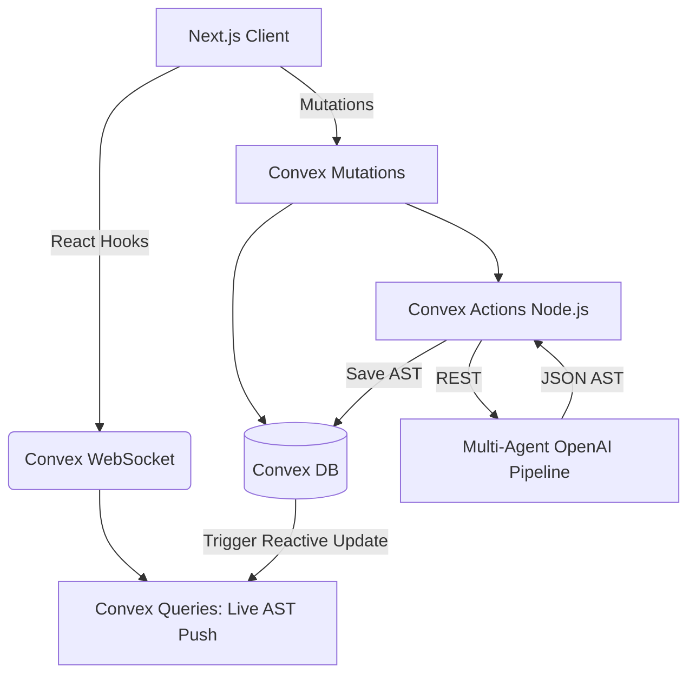
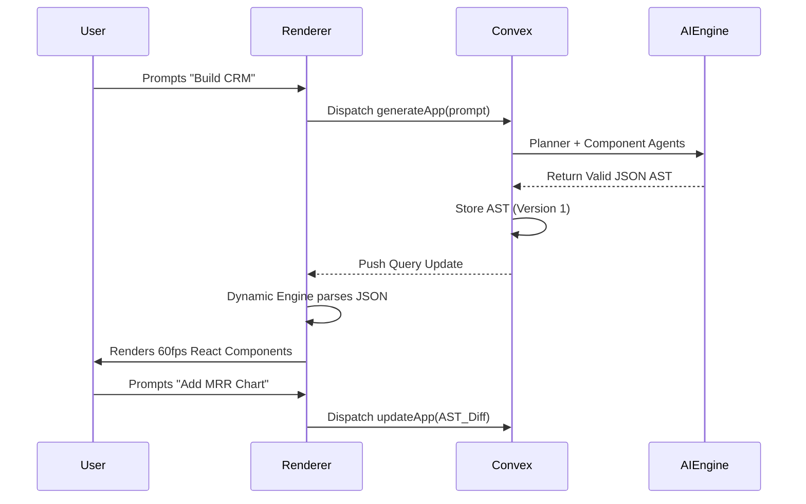
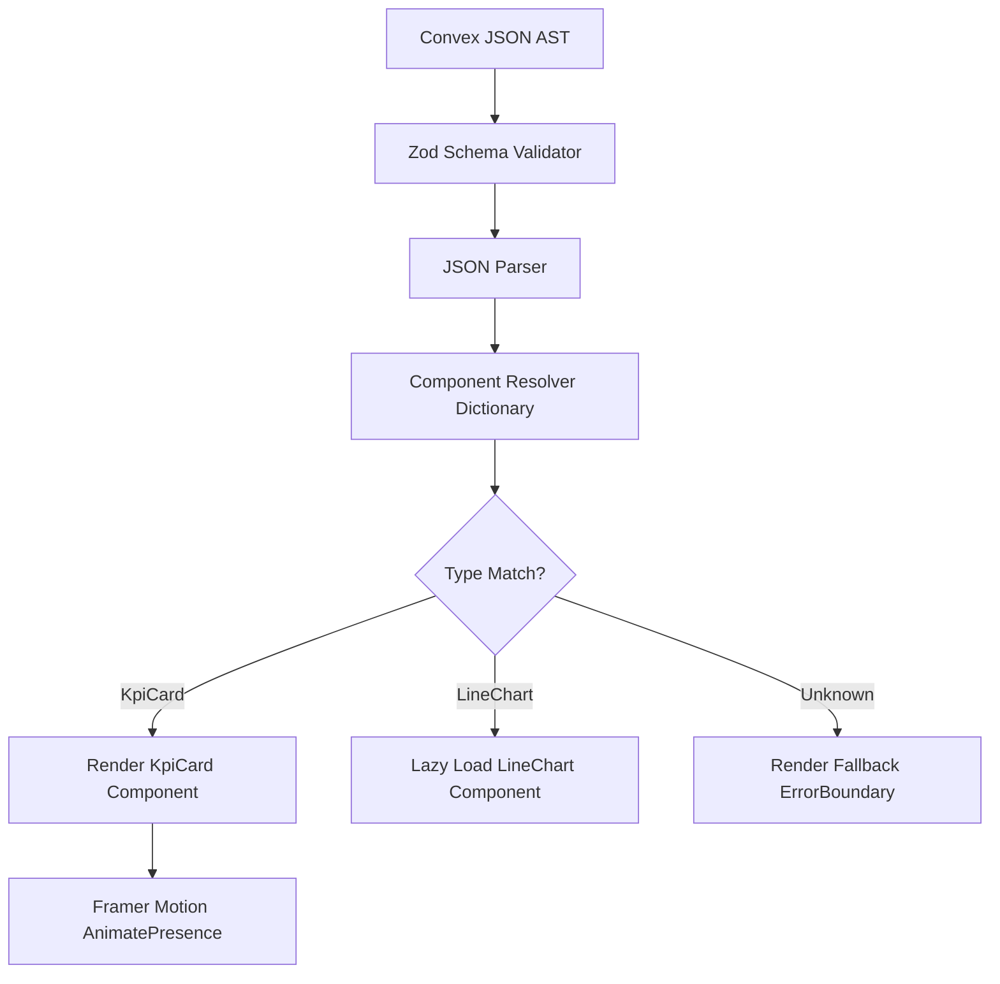
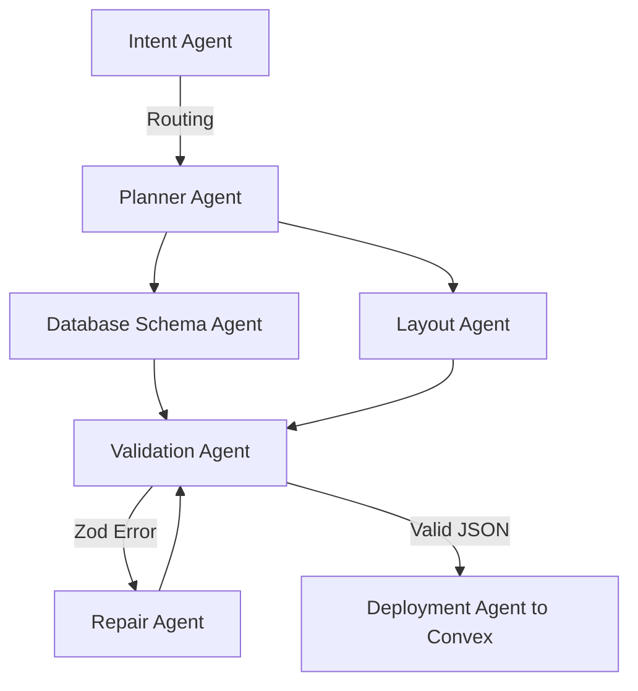

# MorphOS: Technical Design Document (TDD)

**Version:** 1.0.0
**Status:** Engineering Ready
**Author:** MorphOS Architecture Team

---

## Table of Contents
1. [Technical Overview](#1-technical-overview)
2. [System Architecture](#2-system-architecture)
3. [Application Lifecycle](#3-application-lifecycle)
4. [Frontend Architecture](#4-frontend-architecture)
5. [Dynamic Rendering Engine](#5-dynamic-rendering-engine)
6. [Widget System](#6-widget-system)
7. [AI Engine](#7-ai-engine)
8. [Prompt Pipeline](#8-prompt-pipeline)
9. [Schema System](#9-schema-system)
10. [Convex Architecture](#10-convex-architecture)
11. [Database Design](#11-database-design)
12. [API Contracts](#12-api-contracts)
13. [Realtime Engine](#13-realtime-engine)
14. [Authentication](#14-authentication)
15. [Folder Structure](#15-folder-structure)
16. [Design System Architecture](#16-design-system-architecture)
17. [State Management](#17-state-management)
18. [Security](#18-security)
19. [Error Handling](#19-error-handling)
20. [Performance Optimization](#20-performance-optimization)
21. [Deployment](#21-deployment)
22. [Observability](#22-observability)
23. [Testing Strategy](#23-testing-strategy)
24. [Scalability](#24-scalability)
25. [Implementation Plan](#25-implementation-plan)
26. [Engineering Guidelines](#26-engineering-guidelines)

---

## 1. Technical Overview

MorphOS is a Generative Operating Interface. It relies on a deterministic **Abstract Syntax Tree (AST)** represented in strict JSON.
- **Frontend:** Next.js 15 (App Router), React 19, Tailwind CSS, Framer Motion.
- **Backend/State:** Convex (Serverless Database + WebSockets).
- **Intelligence:** Multi-Agent Pipeline via OpenAI GPT-4o using Structured Outputs.
- **Runtime Model:** Convex pushes JSON schemas to Next.js clients over WebSockets. Next.js parses the JSON and recursively maps it to lazy-loaded React components in real-time.

---

## 2. System Architecture



**Subsystem Overview:**
- **Purpose:** Serve ultra-low latency collaborative UIs.
- **Performance Target:** 50ms sync latency, < 6s AI generation time.
- **Failure Mode:** WebSocket disconnect.
- **Recovery:** Convex client automatically buffers state and reconnects.

---

## 3. Application Lifecycle



---

## 4. Frontend Architecture
- **App Router:** Fully leverages Next.js 15 Server Components for initial shell load.
- **Client Components:** The Dynamic Renderer is marked `"use client"` because it requires React state and Framer Motion animations.
- **Suspense & Streaming:** Heavy charts (e.g., Recharts, Chart.js) are wrapped in `<Suspense fallback={<Skeleton />}>` and loaded via `next/dynamic`.

---

## 5. Dynamic Rendering Engine

The core loop of MorphOS. It NEVER uses `eval()` or HTML injection.



- **Component Factory:** Uses a dictionary mapping: `const COMPONENT_MAP = { KpiCard, LineChart, DataTable }`.
- **Responsive Layout Engine:** Parses AST `layout` keys (e.g., `span: 4`) into Tailwind CSS grid column utility classes.
- **Memory Management:** React 19's optimized DOM diffing ensures only modified JSON nodes trigger DOM repaints.

---

## 6. Widget System

Every widget inherits from a base `WidgetWrapper` that handles error boundaries, layout properties, and data-binding contexts.

| Widget | Props | Data Binding | Validation |
|---|---|---|---|
| **KPI** | `title, value, trend, icon` | Static or Convex Query | Zod: `z.number()` for value. |
| **LineChart** | `series, x_axis, colors` | Array of objects | `recharts` mapping validation. |
| **DataTable** | `columns, rows, pagination` | Realtime streaming | Strict column-to-data mapping. |
| **Form** | `fields, submitMutation` | Form state | React Hook Form + Zod resolver. |

---

## 7. AI Engine (Multi-Agent System)

Monolithic LLM calls fail on complex applications. MorphOS uses specialized agents.


- **Intent Agent:** Determines if user means "New App" or "Modify Existing".
- **Planner Agent:** Creates the blueprint (e.g., "We need 2 KPIs and 1 Chart").
- **Repair Agent:** If output fails Zod parsing, this agent receives the exact Error Stack and corrects the JSON structure before user sees it.

---

## 8. Prompt Pipeline
1. **Sanitization:** Strip dangerous inputs.
2. **Context Assembly:** Inject current AST + User Roles + Workspace metadata.
3. **Generation:** GPT-4o call with `response_format: json_schema`.
4. **Validation (Server-Side):** `schema.parse(llmOutput)`.
5. **Storage:** `ctx.db.insert('schemas', validAst)`.

---

## 9. Schema System
- **Versioning:** Immutable architecture. Every mutation writes a NEW schema row with an incremented `version_number`.
- **Storage:** Convex `schemas` table.
- **Rollback:** Simply update the Application's `currentVersionId` pointer to an older schema ID. Convex instantly pushes the old AST to clients.

---

## 10. Convex Architecture
- **Realtime:** Next.js uses `useQuery(api.dashboards.get, { id })`. Convex maintains WebSocket.
- **Actions (V8 Isolates):** Node.js runtime for calling OpenAI securely.
- **Scheduling:** Convex `ctx.scheduler.runAfter` used for background data aggregation.
- **Conflict Resolution:** Last-write-wins on AST patches. Collaborative cursors handle presence without DB commits.

---

## 11. Database Design (Convex schema.ts)

| Table | Fields | Indexes |
|---|---|---|
| `workspaces` | `_id`, `name`, `ownerId` | `by_owner` |
| `applications` | `_id`, `workspaceId`, `title`, `currentVersionId` | `by_workspace` |
| `schemas` | `_id`, `appId`, `version`, `ast_payload` (JSON) | `by_app_version` |
| `messages` | `_id`, `appId`, `role`, `content`, `timestamp` | `by_app_time` |

---

## 12. API Contracts
All APIs are strictly typed via Convex arguments.

```typescript
export const generateApp = action({
  args: { prompt: v.string(), workspaceId: v.id("workspaces") },
  handler: async (ctx, args) => {
    // 1. Call OpenAI
    // 2. Validate
    // 3. Dispatch Mutation
    return schemaId;
  }
});
```
- **Retries:** Handled internally by Convex Actions on network failure.
- **Rate Limits:** Implementing Upstash Redis within Convex Actions (max 10 gens/min per user).

---

## 13. Realtime Engine
- **Optimistic Updates:** Using `useMutation`. The UI updates instantly. If the server rejects the schema edit, it rolls back gracefully.
- **Collaboration Latency:** Convex WebSocket layer aims for < 50ms region-specific delivery.

---

## 14. Authentication
- **Clerk/NextAuth + Convex:** JWT validation happens natively inside Convex queries.
- **RBAC:** `if (!isWorkspaceAdmin(ctx)) throw new Error("Unauthorized");` injected into every mutation via Convex middleware wrappers.

---

## 15. Folder Structure
```text
morphos/
├─ apps/
│  └─ web/                 # Next.js Application
├─ packages/
│  ├─ ui/                  # shadcn/ui + Tailwind Components
│  ├─ renderer/            # Core Dynamic Rendering Engine
│  ├─ agents/              # Multi-agent AI logic
│  └─ schemas/             # Zod AST definitions
├─ convex/                 # Backend Database & APIs
│  ├─ schema.ts
│  ├─ mutations/
│  └─ actions/
└─ package.json            # Turborepo Root
```

---

## 16. Design System Architecture
- **Tokens:** Defined in `tailwind.config.js` and injected globally via `globals.css`.
- **Variables:** `--background: 240 10% 3.9%`, `--primary: 263.4 70% 50.4%`.
- **Animations:** Standardized Framer Motion variants (`revealUp`, `fade`, `scaleIn`) stored in `packages/ui/animations`.

---

## 17. State Management
- **Server State:** 95% of state (AST, data, chat) managed via `convex/react` queries.
- **Client State:** Zustand used strictly for local UI states (e.g., `isSidebarOpen`, `activeWidgetId`).
- **Offline Support:** Convex automatically buffers mutations.

---

## 18. Security
- **XSS Mitigation:** The Renderer ONLY accepts predefined keys. It never renders raw HTML.
- **JSON Validation:** Zod schemas are strict (`.strip()`) to remove malicious injections.
- **Secrets:** OpenAI keys stored securely in Convex Environment Variables.

---

## 19. Error Handling
- **Database Failure:** Convex is fully managed. Client enters `reconnecting` state.
- **Render Failure:** `<ErrorBoundary fallback={<WidgetError />}>` prevents full page crash.
- **AI Failure:** Fallback UI: "AI is experiencing high latency. Try again."

---

## 20. Performance Optimization
- **Dynamic Imports:** Heavy charts `const LineChart = dynamic(() => import('./LineChart'), { ssr: false })`.
- **Bundle Optimization:** `recharts` is strictly tree-shaken.
- **Memoization:** AST parsing results are wrapped in `useMemo` to prevent re-renders on unrelated state changes.

---

## 21. Deployment
- **Frontend:** Vercel (Edge routing, PR previews).
- **Backend:** Convex Cloud (Prod/Dev environments automatically managed).
- **CI/CD:** GitHub Actions -> Run Vitest -> Deploy Vercel.

---

## 22. Observability
- **Metrics/Tracing:** Vercel Analytics for Web Vitals (LCP, FID).
- **Logging:** Convex Dashboard for backend action durations and LLM token usage tracking.

---

## 23. Testing Strategy
- **Unit:** Vitest for JSON parsing, Zod schemas, and Agent routing logic.
- **Component:** Storybook + React Testing Library for the 35+ Widgets.
- **E2E:** Playwright tests checking end-to-end generation flow.

---

## 24. Scalability
- **Horizontal Scaling:** Next.js on Vercel is infinitely horizontally scalable.
- **WebSocket Scaling:** Convex inherently scales WebSocket connections globally.
- **LLM Scaling:** Implement load balancing across OpenAI organization keys if rate limits are hit.

---

## 25. Implementation Plan
| Sprint | Goal | Acceptance Criteria |
|---|---|---|
| **S1: Core Infra** | Monorepo setup, Convex init, Tailwind config. | App runs locally with DB connection. |
| **S2: Renderer** | Implement Dynamic Engine + 5 base widgets. | Manually written JSON AST renders correctly. |
| **S3: AI Engine** | Implement OpenAI Agents + Zod Validation. | CLI tool generates valid AST from prompt. |
| **S4: Integration** | Connect AI -> Convex -> Renderer. | End-to-end generation in browser. |
| **S5: Realtime** | Copilot Chat, optimistic updates, cursors. | Multi-browser sync works flawlessly. |
| **S6: Polish** | Animations, Error Boundaries, deployment. | Production ready for launch. |

---

## 26. Engineering Guidelines
- **Coding Standard:** Strict TypeScript. No `any`.
- **Component Structure:** Functional components, early returns, custom hooks for logic.
- **Commits:** Conventional Commits (`feat:`, `fix:`, `chore:`).
- **PR Rules:** Require 1 approval + successful CI passing (Lint, Typecheck, Vitest).

---
*End of TDD. Single Source of Truth for MorphOS Engineering.*
